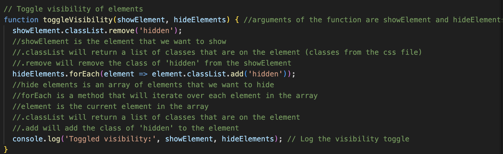

# Hang in There  

### Abstract:
[//]: <> (Briefly describe what you built and its features. What problem is the app solving? How does this application solve that problem?)

Built a webpage using html css and javascript that allows users to generate random motivational posters. Users can save their favorite posters to a favorites section and create their own posters.

### Installation Instructions:
[//]: <> (What steps does a person have to take to get your app cloned down and running?)

1. Fork this repo
2. Clone the repo to your local machine
3. Open the `index.html` file in your browser

### Preview of App:
[//]: <> (Provide ONE gif or screenshot of your application - choose the "coolest" piece of functionality to show off. gifs preferred!)

### Context:
[//]: <> (Give some context for the project here. How long did you have to work on it? How far into the Turing program are you?)

Worked on it for about four days. But the bulk of the work was done in a two day period and I spent the rest trying to refactor and clean up the code and ensuring functionality. I am currently in module 2 of the Turing program.

### Contributors:
[//]: <> (Who worked on this application? Link to your GitHub. Consider also providing LinkedIn link)

Donte Handy

[GitHub](https://github.com/dontehandy
)

[LinkedIn](https://www.linkedin.com/in/dontehandy/)

### Learning Goals:
[//]: <> (What were the learning goals of this project? What tech did you work with?)

- Gain a better understanding of how to manipulate the DOM using javascript

- Learn how to use event listeners to create interactivity on a webpage

- I worked with HTML, CSS, and JavaScript. 

### Wins + Challenges:
[//]: <> (What are 2-3 wins you have from this project? What were some challenges you faced - and how did you get over them?)

Wins: exposure to the DOM and how to manipulate it. I was able to create a webpage that was interactive and fun to use.

Wins: exposure to event listeners and how to use them to create interactivity on a webpage.

Wins: global variables and how to use them to store data that can be accessed by multiple functions.

Challenges: Getting the unmotivational posters to display properly but after using a console.log to see what was being returned from the fetch request. I was able to see that the data was being returned as an object and not an array. I was able to use Object.values() to convert the object to an array and then display the posters properly.